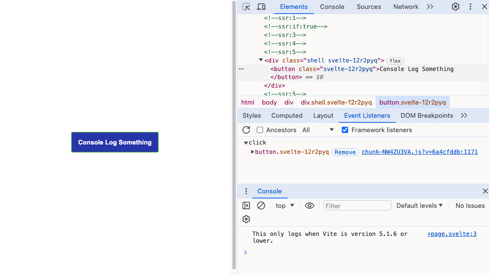
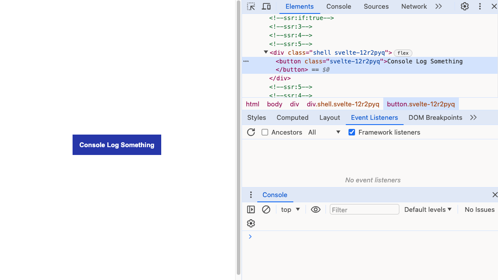

# inlang-sveltekit-vite-bug

To run:

```sh
npm install
npm run dev
```

This works out of the box:



To see the error, stop the app and run:

```sh
npm run update
```

And update to the latest version of Vite.

Re-run the app (`npm run dev`).

Open up and inspect in developer tools. The event listener is missing from the button on the main page, and you can no longer click the button:


